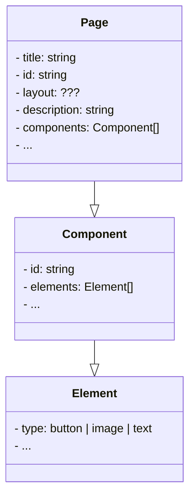

# Soveltavat tehtävät

Tämän sivun tehtävät käsittelevät TypeScriptin hyödyntämistä kuvitteellisen sisällönhallintajärjestelmän (Content Management System, CMS) kehityksessä. Voit luoda näitä tehtäviä varten uuden TypeScript-projektin tai jatkaa kehittämistä aikaisemmissa harjoituksissa käyttämässäsi projektissa.

Tämän sivun tehtäviin ei ole yhtä ainoaa oikeaa ratkaisua. Tärkeintä on, että sovellat oppimaasi ja toteutat ratkaisun parhaaksi katsomallasi tavalla. Saadaksesi tehtävästä hyväksytyn suorituksen sinun ei tarvitse saada kaikkia kohtia toteutettua. Riittää, että osoitat kykyä soveltaa kurssin sisällössä käsiteltyjä aiheita.


## Tehtävänanto

Kehität sovellusta, joka käsittelee sisällönhallintajärjestelmän luomien verkkosivujen rakennetta. Tavoitteesi on luoda TypeScript-tyyppejä edustamaan tämän järjestelmän osia määrittelemällä mm. elementtien, komponenttien ja sivujen tyypit.

Elementti voi olla esimerkiksi painike, kuva tai teksti. Komponentti puolestaan on uudelleenkäytettävä sivun osa, joka koostuu yhdestä tai useammasta elementistä. Sivu, eli ylimmän tason rakenne, koostuu otsikosta, id:stä, kuvauksesta ja joukosta komponentteja. Luokkakaaviona asiaa voitaisiin esittää esimerkiksi seuraavasti:




## Vaihe 1: määrittele tietotyypit `Page`, `Component` ja `Element`

Määrittele TypeScript-tyypit `Element`, `Component` ja `Page`. Määrittele tyypit siten, että `Page` hyödyntää `Component`-tyyppiä, joka puolestaan hyödyntää `Element`-tyyppiä. Määrittele yllä olevassa kaaviossa esitetyt attribuutit sekä niiden lisäksi omia attribuutteja, joita uskot sivuston rakenteessa tarvittavan.

`Element`-tyypin tulee voida mallintaa niin painikkeita, kuvia kuin tekstiä. Voit ratkaista tämän tekemällä esimerkiksi jokaista eri tyyppistä elementtiä varten erillisen tyypin ja toteuttaa `Element`:in näiden unionina. Myös muut tavat kelpaavat.

`Page`-tyypillä on kaaviossa `layout`-attribuutti, jonka tarkoituksena on määritellä "sivupohja", jonka mukaisesti sivun komponentit asetellaan. Näitä `layout`:eja voivat olla esimerkiksi `"MainPage"`, `"ArticlePage"`, `"ContactPage"` tai `"DefaultPage"`. Toteuta layout parhaaksi katsomallasi tavalla siten, että myös uusia sivupohjia voidaan lisätä kohtuullisella vaivalla myöhemmin.

:::info

Jos TypeScript-projektissasi on mukana [*dom*-kirjasto](https://www.typescriptlang.org/docs/handbook/dom-manipulation.html), et todennäköisesti voi nimetä elementtityyppiä `Element`-nimiseksi:

> ⛔ lib.dom.d.ts: 'Element' was also declared here.

Tämä johtuu siitä, että dom-kirjastossa [on jo valmiiksi määritettynä tyyppi nimeltä `Element`](https://github.com/microsoft/TypeScript/blob/593af47fa122a8017b956580856faa0e87aab4b6/src/lib/dom.generated.d.ts#L7624). Tässä tapauksessa anna omalle tyypillesi nimeksi esimerkiksi `PageElement`.

:::


## Vaihe 2: esimerkkisivu, joka hyödyntää yllä määritettyjä tyyppejä

Määrittele `mainPage`-sivu, joka edustaa kuvitteellisen sivuston etusivua. Määrittele tälle sivulle `heading`-, `mainSection`- ja `footer`-komponentit parhaaksi katsomillasi elementeillä siten, että se saattaisi muistuttaa jotain yksinkertaista todellista sivua. Kaikkien edellä mainittujen komponenttien sisällä voi olla tekstiä, kuvia ja painike-elementtejä. Esimerkiksi alatunnisteessa (`footer`), on tyypillisesti tekstielementtejä yhteystiedoille tai muulle alatunnistesisällölle.

```ts
const mainPage: Page = {
    // TODO
};
```

## Vaihe 3: alisivutyyppi `SubPage`

Toteuta seuraavaksi uusi `SubPage`-tyyppi. Alisivu eli `SubPage` on muuten kuten yllä määritelty `Page`, mutta alisivulla ei ole kuvausta ja sillä on yläsivu. Voit toteuttaa yhteyden yläsivuun joko id:n avulla (`parentId: string`) tai viittaamalla suoraan pääsivuun (`parent: Parent`).

Pyri toteuttamaan `SubPage` hyödyntäen [aputyyppejä](../tyypit/08-utility-types.md) sekä [leikkausta (intersection)](../tyypit/05-unions-intersections.md).

Luo lisäksi alisivu "About us" edellisessä vaiheessa luomallesi pääsivulle parhaaksi katsomallasi sisällöllä.

```ts
const aboutUs: SubPage = {
    // TODO
};
```

:::info

Huomaa, että voit uudelleenkäyttää pääsivun komponentteja tai elementtejä. Pyri kuitenkin olemaan kopioimatta koodia. Koodin kopioinnin sijasta voit viitata molemmista sivuista samaan komponenttiin tai elementtiin.

:::

## Vaihe 4: geneeriset sivu- ja komponenttityypit

Sovelluksesi kehittyessä haluat tukea myös edistyneempiä tyyppejä. Edistyneempien tyyppien tarkoituksena on mahdollistaa eri komponenteille ja sivuille erilaisia lisätietoja ja toisaalta myös rajoittaa sitä, missä kohdin sivuja eri tyyppisiä sisältöjä voidaan käyttää.

Luo uusi [geneerinen](../tyypit/04-generics.md) `BaseComponent`-tyyppi, jota voidaan käyttää tarkempien komponenttien luomiseen. Tämän `BaseComponent`:in avulla on tarkoitus mahdollistaa esimerkiksi alatunnistekomponentteja, jotka sallivat vain tekstielementtejä.

:::tip Esimerkki

Aikaisempien tyyppien toteutuksesta riippuen tämä vaihe voidaan ratkaista monilla eri tavoilla. Voit myös luoda uusia tyyppejä, joita ei pyydetä tehtävänannossa. `BaseComponent`-tyypin avulla on tarkoituksena mahdollistaa tarkemmin rajattuja tyyppejä, joilla esim. `FooterComponent` sallii vain `TextElement`-tyyppisiä elementtejä, kun taas `AnyComponent` sallii minkä tahansa `PageElement`-elementin:

```ts
// only text allowed in the footer:
type FooterComponent = BaseComponent<TextElement>;

// this component type allows any element type:
type AnyComponent = BaseComponent<PageElement>
```
:::

Vastaavasti määritä sivuja varten uusi [geneerinen](../tyypit/04-generics.md) `BasePage`-tyyppi, joka vastaa muilta osin `Page`-tyyppiä, mutta sallii vain sille tyyppiparametrina annetun tyypin mukaisia komponentteja. Onnistutko määrittelemään `BasePage`- ja `BaseComponent`-tyyppien avulla uuden `TextPage`-sivutyypin, joka sallii ainoastaan tekstielementtejä?


## Tehtävän palauttaminen

Tehtävät palautetaan kerralla kurssin Teams-ryhmästä löytyvään tehtävään. Ohjeita tehtävän palauttamiseen löydät [Microsoftin ohjeista](https://support.microsoft.com/en-au/topic/turn-in-an-assignment-in-microsoft-teams-e25f383a-b747-4a0b-b6d5-a2845a52092b) ja tarvittaessa voit kysyä apua Teams-kanavalla. Palauta kaikki tiedostot mieluiten yhtenä zip-pakettina. Jos ratkaisusi koostuu vain yhdestä tiedostosta, ei sitä tarvitse pakata.
