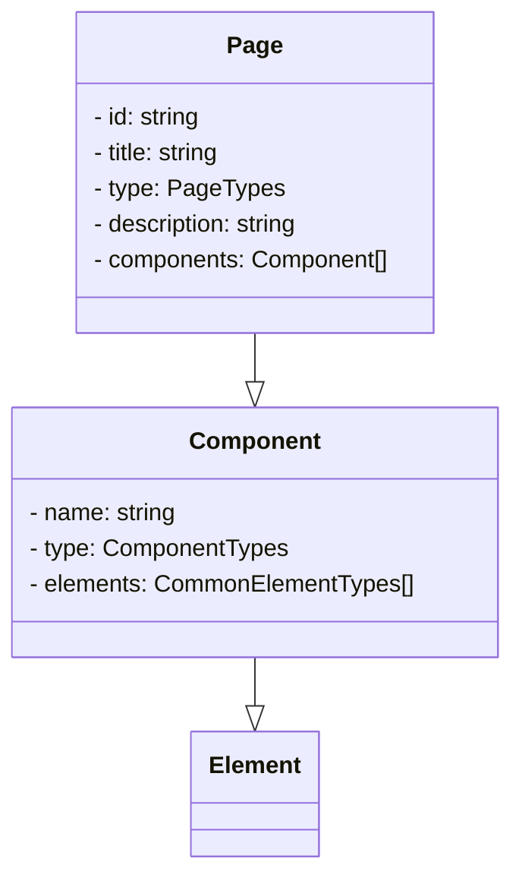

# Soveltavat tehtävät

Tämän sivun tehtävät käsittelevät TypeScriptin hyödyntämistä kuvitteellisen sisällönhallintajärjestelmän (Content Management System, CMS) kehityksessä. Voit luoda näitä tehtäviä varten uuden TypeScript-projektin tai jatkaa kehittämistä aikaisemmissa harjoituksissa käyttämässäsi projektissa.

Tämän sivun tehtäviin ei ole yhtä ainoaa oikeaa ratkaisua. Tärkeintä on, että sovellat oppimaasi ja toteutat ratkaisun parhaaksi katsomallasi tavalla. Saat myös tarvittaessa muokata annettua koodia omanlaisesi ratkaisun toteuttamiseksi.

Saadaksesi tehtävästä hyväksytyn suorituksen sinun ei tarvitse saada kaikkia kohtia toteutettua. Riittää, että osoitat kykyä soveltaa kurssin sisällössä käsiteltyjä aiheita.

Tehtävän pohjaksi löytyy valmis [advanced_exercice.ts-tiedosto](https://raw.githubusercontent.com/typescript-ohjelmointi/typescript-ohjelmointi.github.io/main/docs/harjoitukset/advanced_exercice.ts), johon tekemäsi ratkaisut on tarkoitus täydentää. **Tiedosto sisältää aluksi useita käännösvirheitä**, mutta edetessäsi tehtävässä virheiden pitäisi poistua tai vähentyä. Optimaalisessa tapauksessa **sinun tarvitsee muuttaa ainoastaan kohtia, jotka on merkitty `TODO`-kommentein**. Palauta lopuksi muokkaamasi tiedosto Teamsiin.


## Tehtävänanto

Kehität sovellusta, joka käsittelee sisällönhallintajärjestelmän luomien verkkosivujen rakennetta. Tavoitteesi on luoda TypeScript-tyyppejä edustamaan tämän järjestelmän osia määrittelemällä mm. elementtien, komponenttien ja sivujen tyypit.

Elementit voivat olla painikkeita, kuvia tai tekstiä:

```ts
type CommonElementTypes = "Button" | "Img" | "Text";
```

Komponentti puolestaan on uudelleenkäytettävä sivun osa, joka koostuu yhdestä tai useammasta elementistä:

```ts
type Component = {
    name: string;
    type: ComponentTypes;
    elements: CommonElementTypes[];
};
```

Sivu, eli ylimmän tason rakenne, koostuu otsikosta, id:stä,  otsikosta, tyypistä, kuvauksesta ja joukosta komponentteja. Luokkakaaviona asiaa voitaisiin esittää esimerkiksi seuraavasti:




## Vaihe 1: Täydennä `Page`-tyyppi sekä `mainSection`-olio

[Tehtävätiedostossa](https://raw.githubusercontent.com/typescript-ohjelmointi/typescript-ohjelmointi.github.io/main/docs/harjoitukset/advanced_exercice.ts) on määritettynä sivua varten `type Page`. Tästä tyypistä puuttuu kuitenkin yksi attribuutti. Lisää puuttuva attribuutti niin, että tiedostossa alempana `mainPage`-muuttujaan liittyvä käännösvirhe poistuu. Vihjeen puuttuvasta attribuutista löydät ylempää luokkakaaviosta sekä tehtävätiedostossa esiintyvästä oliosta.

Lisää myös hieman alempaa `mainSection`-olioon siitä puuttuva taulukko. Voit itse vapaasti päättää, mitä elementtityyppejä `mainSection` sisältää.


## Vaihe 2: alisivutyyppi `SubPage`

Perehdy seuraavaksi tehtävätiedoston `SubPage`-tyyppiin:

```ts
type SubPage = ...
```

Alisivu eli `SubPage` on muuten kuten yllä määritelty `Page`, mutta alisivulla ei ole kuvausta ja sillä on yläsivu. Yhteys yläsivuun tulee toteuttaa uudella `parentId`-muuttujalla, jolla viitataan yläsivun `id`:hen .

:::tip

Pyri toteuttamaan `SubPage` hyödyntäen [aputyyppejä](../tyypit/08-utility-types.md) sekä [leikkausta (intersection)](../tyypit/05-unions-intersections.md) siten, että sinun ei tarvitse toistaa tässä kohdassa `Page`-tyyppiin määritettyjä ominaisuuksia. Jos tämä ei onnistu, voit myös toteuttaa `SubPage`-tyypin toistamalla `Page`-tyypin määrittelyn ja tehdä suoraan siihen tarvittavat muutokset.

:::

## Vaihe 3: geneeriset sivu- ja komponenttityypit

Sovelluksesi kehittyessä haluat tukea myös edistyneempiä tyyppejä.

Edistyneempien tyyppien tarkoituksena on mahdollistaa eri komponenteille ja sivuille erilaisia lisätietoja ja toisaalta myös rajoittaa sitä, missä kohdin sivuja eri tyyppisiä sisältöjä voidaan käyttää. Esimerkiksi oheisessa `Header`-komponenttityypissä halutaan sallia vain painikkeita ja kuvia:

```ts
type HeaderComponent = BaseComponent<"Header", "Button" | "Img">;
```

Täydennä tehtävätiedostoon seuraavaksi `FooterComponent`-tyyppi, jonka nimi on "Footer" ja joka sallii vain tekstiä ja kuvia:

```ts
type FooterComponent = BaseComponent<"?", "?">;
```

:::info 🎉 🥳

Tämän `FooterComponent`-tyypin täydentäminen korjaa lukuisia virheitä alempana tehtävätiedostossa.

:::

## Vaihe 4: `subPageAdvanced`-olion korjaaminen

Pyri korjaamaan `subPageAdvanced`-olion määrittelyssä esiintyvä käännösvirhe.

Käännösvirheen ratkaisemiseksi sinun tulee perehtyä `SubPageAdvanced`-tyyppiin sekä siihen liittyviin kommentteihin. Vain tietyt komponentit ovat tässä tyypissä sallittuja, ja vain tietyssä järjestyksessä.

:::tip

Osan ratkaisemiseksi sinun tarvitsee **poistaa** virheellinen sisältö. Älä siis turhaan yritä muuttaa virheellistä sisältöä tai siihen liittyviä tyyppimäärityksiä.

:::

## Vaihe 5: `pageWithGenericConfiguration`-olion korjaaminen

Viimeisessä vaiheessa on jäljellä enää yksi virhe. Se ratkeaa, kun täydennät `pageWithGenericConfiguration`-olion `PageWithGenericConfiguration`-tyypin määritelmän mukaiseksi.

Mikäli sait kaikki vaiheet oikein, `advanced_exercice.ts` kääntyy nyt kokonaan ilman virheitä. Onneksi olkoon!


## Tehtävän palauttaminen

Tehtävä palautetaan kerralla kurssin Teams-ryhmästä löytyvään tehtävään. Ohjeita tehtävän palauttamiseen löydät [Microsoftin ohjeista](https://support.microsoft.com/en-au/topic/turn-in-an-assignment-in-microsoft-teams-e25f383a-b747-4a0b-b6d5-a2845a52092b) ja tarvittaessa voit kysyä apua Teams-kanavalla.

Jos ratkaisusi koostuu vain yhdestä tiedostosta, ei sitä tarvitse pakata, mutta jos palautat useita tiedostoja, tee niistä zip-paketti.
