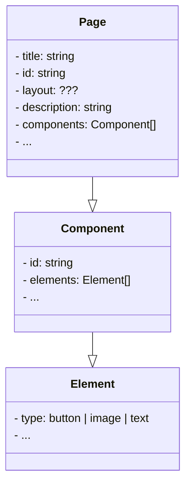

# Soveltavat tehtävät

Tämän sivun tehtävät käsittelevät TypeScriptin hyödyntämistä kuvitteellisen sisällönhallintajärjestelmän (Content Management System, CMS) kehityksessä. Voit luoda näitä tehtäviä varten uuden TypeScript-projektin tai jatkaa kehittämistä aikaisemmissa harjoituksissa käyttämässäsi projektissa.

Tämän sivun tehtäviin ei ole yhtä ainoaa oikeaa ratkaisua. Tärkeintä on, että sovellat oppimaasi ja toteutat ratkaisun parhaaksi katsomallasi tavalla. Saadaksesi tehtävästä hyväksytyn suorituksen sinun ei tarvitse saada kaikkia kohtia toteutettua. Riittää, että osoitat kykyä soveltaa kurssin sisällössä käsiteltyjä käsitteitä.


## Tehtävänanto

Kehität sovellusta, joka käsittelee sisällönhallintajärjestelmän luomien verkkosivujen rakennetta. Tavoitteesi on luoda TypeScript-tyyppejä edustamaan tämän järjestelmän osia määrittelemällä mm. elementtien, komponenttien ja sivujen tyypit.

Elementti voi olla esimerkiksi painike, kuva tai teksti. Komponentti puolestaan on uudelleenkäytettävä sivun osa, joka koostuu yhdestä tai useammasta elementistä. Sivu, eli ylimmän tason rakenne, koostuu otsikosta, id:stä, kuvauksesta ja joukosta komponentteja. Luokkakaaviona asiaa voitaisiin esittää esimerkiksi seuraavasti:



## Vaihe 1: määrittele tietotyypit `Page`, `Component` ja `Element`

Määrittele TypeScript-tyypit `Element`, `Component` ja `Page`. Määrittele tyypit siten, että `Page` hyödyntää `Component`-tyyppiä, joka puolestaan hyödyntää `Element`-tyyppiä. Määrittele yllä olevassa kaaviossa esitetyt attribuutit sekä niiden lisäksi omia attribuutteja, joita uskot sivuston rakenteessa tarvittavan.

`Element`-tyypin tulee voida mallintaa niin painikkeita, kuvia kuin tekstiä. Voit ratkaista tämän tekemällä esimerkiksi jokaista eri tyyppistä elementtiä varten erillisen tyypin ja toteuttaa `Element`:in näiden unionina. Myös muut tavat kelpaavat.

`Page`-tyypillä on kaaviossa `layout`-attribuutti, jonka tarkoituksena on määritellä "sivupohja", jonka mukaisesti sivun komponentit asetellaan. Näitä `layout`:eja voivat olla esimerkiksi `"MainPage"`, `"SubPage"` tai `"InfoPage"`. Toteuta layout parhaaksi katsomallasi tavalla siten, että myös uusia sivupohjia voidaan lisätä kohtuullisella vaivalla myöhemmin.


## Vaihe 2: esimerkkisivu, joka hyödyntää yllä määritettyjä tyyppejä

Määrittele `mainPage`-sivu, joka edustaa kuvitteellisen sivuston etusivua. Määrittele tälle sivulle `heading`-, `mainSection`- ja `footer`-komponentit parhaaksi katsomillasi elementeillä.

Määritä etusivun pääosioon (`mainSection`) komponentti, jossa sivun pääsisältö sijaitsee. Sisältö voi olla tekstiä, kuvia ja painike-elementtejä. Määritä alaosa (`footer`), joka sisältää vain tekstielementtejä tekijänoikeustiedoille tai muulle alatunnistesisällölle.

```ts
const mainPage: Page = {
    // TODO
};
```

## Vaihe 3: alisivutyyppi `SubPage`

Toteuta seuraavaksi uusi `SubPage`-tyyppi. Alisivu eli `SubPage` on muuten kuten yllä määritelty `Page`, mutta alisivulla ei ole kuvausta ja sillä on `parentId` tai `parent`, joka viittaa pääsivuun, jonka alisivuna se on. Voit valintasi mukaan toteuttaa viittauksen yläsivuun joko hyödyntäen pääsivun `id`:tä tai viitata suoraan kyseiseen olioon.

Pyri toteuttamaan `SubPage` hyödyntäen [aputyyppejä](../tyypit/08-utility-types.md) sekä [leikkausta (intersection)](../tyypit/05-unions-intersections.md).

Luo lisäksi alisivu "About us" edellisessä vaiheessa luomallesi pääsivulle parhaaksi katsomallasi sisällöllä. Voit myös uudelleenkäyttää pääsivun osia, kuten `heading` tai `footer`:

```ts
const aboutUs: SubPage = {
    // TODO
};
```

## Vaihe 4: edistyneet sivu- ja komponenttityypit

Sovelluksesi kehittyessä sinun on esitettävä kehittyneempiä tyyppejä tukeaksesi erilaisia lisätietoja ja rajoittaaksesi sitä, missä kohdin sivuja eri tyyppisiä sisältöjä voidaan esittää.

Päätät luoda `BaseComponent`-tyypin, jota voidaan käyttää tarkempien komponenttien luomiseen. Tämän [geneerisen](../tyypit/04-generics.md) `BaseComponent`:in avulla voit luoda erikoistyyppejä otsikko-, sisältö- ja alatunnistekomponenteille.

Vastaavasti määritä sivuja varten `BasePage`-tyyppi ja laajenna sitä `MainPage`- ja `SubPage`-sivuille määrittääksesi, mitkä komponenttityypit ovat sallittuja eri tyyppisille sivuille. Voit myös luoda tarkemman `SubPage`-tyypin salliaksesi vain tietyt komponentit tämäntyyppisillä alisivuilla.

## Tehtävän palauttaminen

Tehtävät palautetaan kerralla kurssin Teams-ryhmästä löytyvään tehtävään. Ohjeita tehtävän palauttamiseen löydät [Microsoftin ohjeista](https://support.microsoft.com/en-au/topic/turn-in-an-assignment-in-microsoft-teams-e25f383a-b747-4a0b-b6d5-a2845a52092b) ja tarvittaessa voit kysyä apua Teams-kanavalla. Palauta kaikki tiedostot mieluiten yhtenä zip-pakettina. Jos ratkaisusi koostuu vain yhdestä tiedostosta, ei sitä tarvitse pakata.
